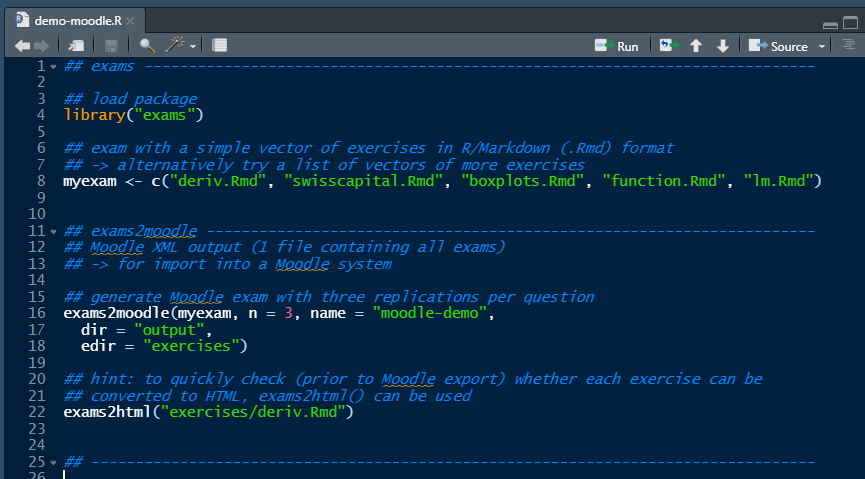

# library(exams) {#exams}

**goals**

Source [First Steps](https://www.r-exams.org/tutorials/first_steps/)

* reduce the risk of cheating
* have a one-for-all exams generator 


**techniques**

Source [First Steps](https://www.r-exams.org/tutorials/first_steps/)

* each exercise is a standalone file

Techiques to reduce the risk of cheating:

* Randomly selecting one (or more) out of a set of exercises for each participant.
* Randomly shuffling answer alternatives in single-choice and multiple-choice questions.
* Randomly selecting numbers, text blocks, graphics, etc. using the R programming language.


**an exercise is**

Source [First Steps](https://www.r-exams.org/tutorials/first_steps/)


Each exercise (or rather “exercise template”):

* Data-generating process in R.
* Question text.
* Solution text.
* Meta-information (later!)


**install in your machine**

Source [Installing R/exams](https://www.r-exams.org/tutorials/installation/)


Steps:

* [Install R, then RStudio](https://posit.co/download/rstudio-desktop/)
* [RTools42](https://cran.r-project.org/bin/windows/Rtools/rtools42/rtools.html)

  * For some tasks (e.g., output for some learning management systems) it is necessary that the base R zip() function works. On Windows this requires to install the Rtools and to include them in the PATH environment variable. "Rtools is a toolchain bundle used for building R packages from source"

* Install `exams` package:

```r
install.packages("exams", dependencies = TRUE)
```


**first steps in your machine**

Source [First steps](https://www.r-exams.org/tutorials/first_steps/)

Create a folder for questions base and do

``` r
setwd("c:/<folder>/rexams-questions")
```

Note: in R one must use "c:/" instead of "c:".


```r
library("exams")
exams_skeleton(markup = "markdown",
  writer = c("exams2html", "exams2pdf", "exams2moodle"))
```

* It generate three folders: exercises, output, templates. 
* "exercises" contains R-Exams.org examples.


## working example "swisscapital"


swisscapital: A static single-choice knowledge quiz question where the only randomization is a subsampling of the presented alternatives.


## working example "deriv"


deriv: A dynamic arithmetic question about the product rule for derivatives where various numbers are drawn randomly in R.


Estudar:

-   <https://www.r-exams.org/assets/posts/2018-12-09-confint3//confint3.Rmd>
-   Diferença entre "Answerlist" e "Meta-information" 

5.  Follow demonstration:




