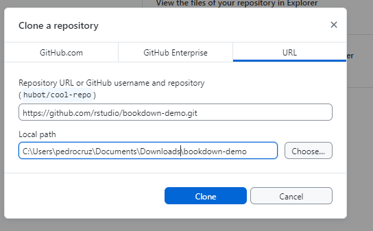
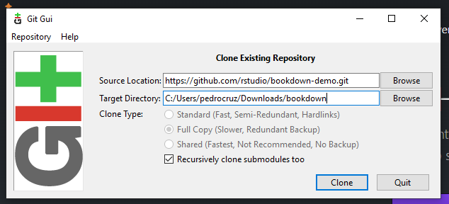
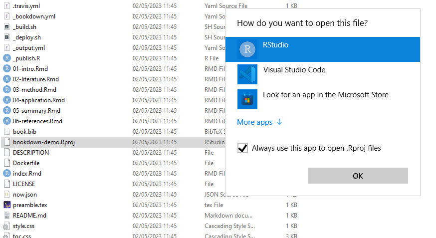

# library(bookdown)


* First do `knitr` on `index.Rmd`to create `packages.bib` file.

* [BOOKDOWN](https://bookdown.org/) Write HTML, PDF, ePub, and Kindle books with R Markdown

* [install](https://bookdown.org/yihui/bookdown/get-started.html)

```r
install.packages("bookdown")
```

Clone [bookdown-demo.git](https://github.com/rstudio/bookdown-demo.git) using git for windows









