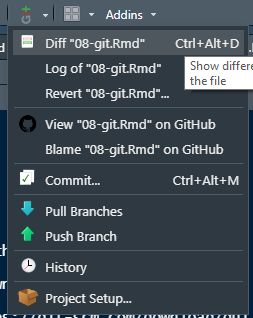

# Git

**git is a tool**

"Git is a distributed version control system that tracks changes in any set of computer files, usually used for coordinating work among programmers collaboratively developing source code during software development." [wikipedia](https://en.wikipedia.org/wiki/Git)

**Platforms**

* [GitHub](https://github.com/)
* [Gitlab](https://gitlab.com/users/sign_in), 
* ...

**Install a git tool**

-   [git desktop](https://desktop.github.com/) -- not directly integrated but easy
-   [git-gui](https://git-scm.com/downloads) -- directly integrated (the other could be easy)
-   [many other implementations](https://git-scm.com/download/gui/windows)

`git-gui`allows incorporation in RStudio:

