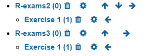

# To do list

- moodle category specification: where can it be specified;(how to specify "importados"?)

- delete routine of "importados"

- To be explored. However, “Cloze” type can handle several questions types in the same file inside an R list.

- The process of exercise creation as motivation to students. -- needs a game behind?

- In RMarkdown, how to specify backticks and avoid "r something" to be executed?

- "Source" and "Visual" modes: "Visual" mode changes the source code without warning!! It's dangerous and a bug report shoulbe be left in RStudio github issues.

- How to specify a Category for moodle when building an exam?

- case with all question types: lm.Rmd, lm2.Rmd, boxhist2.Rmd, fourfold2.Rmd, 

- Outra forma de pensar e organizar: exercícios usando VAR

- Use of `envir =.GlobalEnv`

- Only file question is working and not essay question type

- Estudar <https://www.r-exams.org/assets/posts/2018-12-09-confint3//confint3.Rmd>

1. Fazer "# Moodle"

- o ciclo de importar questões, modificar, apagar questões, truques

2. Organização (dentro do exams)

- 1 ficheiro 1 questão
- 1 ficheiros, muitas questões numa lista

3. Desenvolver exemplos

- fáceis a difíceis

