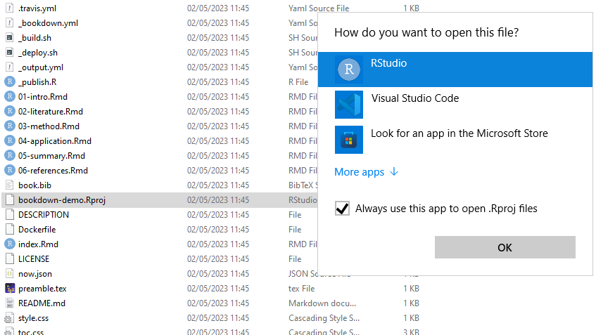

--- 
title: "R Tutorials - some notes"
author: "João Pedro Cruz"
date: "`r Sys.Date()`"
site: bookdown::bookdown_site
output:
  bookdown::html_book:
    theme: 
      uniteddocumentclass: spacelab
bibliography: [book.bib, packages.bib]
biblio-style: apalike
link-citations: yes
github-repo: jpcaveiro/r-tutorials
description: "Some R tutorials or starting guides."
---


```{r echo=F,results=F}
#
# output: bookdown::gitbook
# output: bookdown::pdf_book
#
# automatically create a bib database for R packages
knitr::write_bib(c(
  .packages(), 'bookdown', 'knitr', 'rmarkdown'
), 'packages.bib')
```


# Preface {-}

In this book, we will introduce usefull techinques: rmarkdown, exams (for moodle), bookdown, and git.

It's a **work in progress** started around 2023-05-16 in Granada.

Acknowledgements: M. Montero-Alonso, A. Freitas, C. Miranda.

**About the author**


* Assistant teacher at Mathematics Department ([DMat-UA](https://www.ua.pt/en/dmat/page/2615)) and member of [CIDMA/OGTC](https://cidma.ua.pt/) in colaboration with Assoc. Prof. Adelaide Freitas fromo [Probability and Statistics Group](http://probability.cidma.ua.pt/index)


* <https://www.ua.pt/pt/viver-ua>


<!--chapter:end:index.Rmd-->

# library(exams) {#exams}

**goals**

Source [First Steps](https://www.r-exams.org/tutorials/first_steps/)

* reduce the risk of cheating
* have a one-for-all exams generator 


**techniques**

Source [First Steps](https://www.r-exams.org/tutorials/first_steps/)

* each exercise is a standalone file

Techiques to reduce the risk of cheating:

* Randomly selecting one (or more) out of a set of exercises for each participant.
* Randomly shuffling answer alternatives in single-choice and multiple-choice questions.
* Randomly selecting numbers, text blocks, graphics, etc. using the R programming language.


**an exercise is**

Source [First Steps](https://www.r-exams.org/tutorials/first_steps/)


Each exercise (or rather “exercise template”):

* Data-generating process in R.
* Question text.
* Solution text.
* Meta-information (later!)


**install in your machine**

Source [Installing R/exams](https://www.r-exams.org/tutorials/installation/)


Steps:

* [Install R, then RStudio](https://posit.co/download/rstudio-desktop/)
* [RTools42](https://cran.r-project.org/bin/windows/Rtools/rtools42/rtools.html)

  * For some tasks (e.g., output for some learning management systems) it is necessary that the base R zip() function works. On Windows this requires to install the Rtools and to include them in the PATH environment variable. "Rtools is a toolchain bundle used for building R packages from source"

* Install `exams` package:

```r
install.packages("exams", dependencies = TRUE)
```


**first steps in your machine**

Source [First steps](https://www.r-exams.org/tutorials/first_steps/)

Create a folder for questions base and do

``` r
setwd("c:/<folder>/rexams-questions")
```

Note: in R one must use "c:/" instead of "c:".


```r
library("exams")
exams_skeleton(markup = "markdown",
  writer = c("exams2html", "exams2pdf", "exams2moodle"))
```


## working example "swisscapital"


swisscapital: A static single-choice knowledge quiz question where the only randomization is a subsampling of the presented alternatives.


## working example "deriv"


deriv: A dynamic arithmetic question about the product rule for derivatives where various numbers are drawn randomly in R.


Estudar:

-   <https://www.r-exams.org/assets/posts/2018-12-09-confint3//confint3.Rmd>
-   Diferença entre "Answerlist" e "Meta-information" 

5.  Follow demonstration:


<!--chapter:end:01-exams.Rmd-->

# R Markdown


```{r echo=FALSE}
require(datasets)
```

This is an R Markdown document. Markdown is a simple formatting syntax for authoring HTML, PDF, and MS Word documents. 

*References:*

* [markdown syntax](https://daringfireball.net/projects/markdown/syntax):
    * "Thus, “Markdown” is two things: (1) a plain text formatting syntax; and (2) a software tool, written in Perl, that converts the plain text formatting to HTML."
    
* <http://rmarkdown.rstudio.com>
    * [vast gallery](https://rmarkdown.rstudio.com/gallery.html)


When you click the **Knit** button a document will be generated that includes both content as well as the output of any embedded R code chunks within the document. You can embed an R code chunk like this:


```{r cars}
summary(cars)
```


**Plots**

You can also embed plots, for example:


```{r pressure, echo=TRUE}
plot(pressure)
```


Note that the "echo = FALSE" parameter could be added to the code chunk to prevent printing of the R code that generated the plot.


<!--chapter:end:01-rmarkdown.Rmd-->

# Literature

Here is a review of existing methods.

<!--chapter:end:02-literature.Rmd-->

# library(bookdown)


* First do `knitr` on `index.Rmd`to create `packages.bib` file.

* [BOOKDOWN](https://bookdown.org/) Write HTML, PDF, ePub, and Kindle books with R Markdown

* [install](https://bookdown.org/yihui/bookdown/get-started.html)

```r
install.packages("bookdown")
```

Clone [bookdown-demo.git](https://github.com/rstudio/bookdown-demo.git) using git for windows





<!--chapter:end:03-bookdown.Rmd-->

# Exams {#exams}


```{r echo=FALSE, results=FALSE, messages=FALSE}
knitr::opts_chunk$set(eval = FALSE)
#library(exams)
```


## Concepts


**Goals**


* reduce the risk of cheating
* have a one-for-all exams generator

_References_:

* [First Steps (website of R_Exams)](https://www.r-exams.org/tutorials/first_steps/)
* Achim Zeileis, Nikolaus Umlauf, Friedrich Leisch (2014). "Flexible Generation of E-Learning Exams in R: Moodle Quizzes, OLAT Assessments, and Beyond." Journal of Statistical Software, 58(1), 1-36. <doi:10.18637/jss.v058.i01>
* [Moodle Tests: Not So Much of a Fuss When You Have R
M. Cristina Miranda, Anabela Rocha, ICSIT 2022](https://www.iiis.org/DOI2022/EB443PN/)


**Techniques**


Techniques to reduce the risk of cheating:

* Randomly selecting one (or more) out of a set of exercises for each participant.
* Randomly shuffling answer alternatives in single-choice and multiple-choice questions.
* Randomly selecting numbers, text blocks, graphics, etc. using the R programming language.


_Reference_ [First Steps](https://www.r-exams.org/tutorials/first_steps/)


**Output to several formats**

- html and pdf/LaTeX
- pandoc (for customizable outputs in various formats (Docx, ODF, PDF, ...).
- nops (fixed PDF format that can be automatically scanned and evaluated), 
- LMS: moodle, blackboard,
- QTI XML (various learning management systems: canvaslms, openOlat), arsnova (JSON format)


_References_:

* [file demo-all.Rmd](https://www.r-exams.org/assets/posts/2017-09-10-first_steps//demo-all.R)


**An exercise, in a standalone file**

Each exercise (or rather “exercise template”):

* Data-generating process written in R.
* Question text.
* Solution text.
* Meta-information.

_Reference_ [First Steps](https://www.r-exams.org/tutorials/first_steps/)


**cloze type - a special question format**

"cloze" question type can handle *several questions types*, in the same file, for example inside an R `list` or explicitly described.


## In your machine


**Install**


Some steps:

* [Install R, then RStudio](https://posit.co/download/rstudio-desktop/)
* [RTools42](https://cran.r-project.org/bin/windows/Rtools/rtools42/rtools.html)

  * For some tasks (e.g., output for some learning management systems) it is necessary that the base R zip() function works. On Windows this requires to install the Rtools and to include them in the PATH environment variable. "Rtools is a toolchain bundle used for building R packages from source"

* Install `exams` package:

```r
install.packages("exams", dependencies = TRUE)
```

_Reference_ [Installing R/exams](https://www.r-exams.org/tutorials/installation/)


**Only once**


Create a folder for questions and then do:

```r
setwd("c:/<folder>/rexams-questions")
```

_Note_ in R one must use "c:/" instead of "c:\\".


```r
library("exams")
exams_skeleton(markup = "markdown",
  writer = c("exams2html", "exams2pdf", "exams2moodle"))
```


_Reference_ [First steps](https://www.r-exams.org/tutorials/first_steps/)


## The Slow Development Cycle


We use [already created contents](https://www.r-exams.org/templates/) - there creation coul be an addictive process!!


**Decision about exam contents (step 1/5)** -- a vector of filenames

```{r}
# setwd("~/<root of r-exams project>")
library("exams")
elearn_exam <- c(
  "swisscapital.Rmd",
  "deriv.Rmd",
  "ttest.Rmd",
  "boxplots.Rmd",
  "function.Rmd",
  "lm.Rmd",
  "fourfold2.Rmd")
```


**Appreciate, in html, the future exam (step 2/5)** -- `exams::exams2html()`

```{r}
set.seed(2023-05-16) # or 2002
exams2html(elearn_exam, n = 1, name = "R-exams")
```


* `exams2html` produce html output reading from "exercises" folder and writing to "output" folder
* `name = "R-exams"` specifies the Moodle Category. Below "R-exams" will reside all the exercises numbered "Exercise 1", "Exercise 2", ....
* `n` is the number of variations of a question

rules-of-thumb about *n*:

- maybe one can correct a moodle question in runtime (during exam)
- n=6 is a good number if questions are new (easy to correct)
- n much greater avoid completely participant copy of solutions but in case of error, a lot of work expects the evaluator/teacher


**Publish the exam (step 3/5)** -- `exams::exams2moodle()`

```{r}
set.seed(2023-05-16) 
exams2moodle(elearn_exam, n = 3, name = "R-exams", dir="output")
  ## This yields the file R-exams.xml that can be imported into Moodle.
  ##output folder should contain the xml file.
```

* `name = "R-exams"` the "R-exams" string will define a new category in Moodle structure.


**Moodle import (step 4/5)**

A step-by-step video guide to importing and customizing the quiz in Moodle is available on YouTube at <https://www.youtube.com/watch?v=5K9hrE3YkPs>.


**Moodle direct observation (step 5/5)**

Direct observation, of questions, in moodle can clean last mistakes or errors.


_Reference_  [E-Learning Quizzes](https://www.r-exams.org/tutorials/elearning/)


## stackoverflow

More than 250 questions:

Exemple: "Change TRUE and FALSE to Verdadero and Falso in "mchoice" exercises of R-exams":
[answer here](https://stackoverflow.com/questions/75249954/change-true-and-false-to-verdadero-and-falso-in-mchoice-exercises-of-r-exams)

* More questions: <https://stackoverflow.com/questions/tagged/r-exams/>


_Reference_ [Resources](https://www.r-exams.org/resources/)

<!--chapter:end:03-exams.Rmd-->

# Moodle and exams

```{r echo=FALSE}
require(exams)
```

Moodle *standard* question types:

-   [ ] 2.1 Calculated
-   [ ] 2.2 Calculated multi-choice
-   [ ] 2.3 Calculated simple
-   [ ] 2.4 Drag and drop into text
-   [ ] 2.5 Drag and drop markers
-   [ ] 2.6 Drag and drop onto image
-   [ ] 2.7 Description
-   [x] 2.8 Essay
-   [ ] 2.9 Matching
-   [x] 2.10 Embedded Answers (Cloze Test / Gap Fill)
-   [x] 2.11 Multiple choice
-   [x] 2.12 Short Answer
-   [x] 2.13 Numerical
-   [ ] 2.14 Random short-answer matching
-   [ ] 2.15 Select missing words
-   [x] 2.16 True/False
-   [x] File (essay that only requests a file from the participant)

 package `exams` can produce output to moodle


*References*

-   [Question Types](https://docs.moodle.org/402/en/Question_types)
-   [Dynamic Exercises](https://www.r-exams.org/intro/dynamic/)


## schoice

View example [swisscapital: Knowledge Quiz Question about the Swiss Capital](https://www.r-exams.org/templates/swisscapital/).

*Single Choice* means only one sentence is correct.

    Meta-information
    ================
    exname: Swiss Capital
    extype: schoice
    exsolution: 0100000
    exshuffle: 5

-   `exname: Swiss Capital` (exercise: where `exname` is used?)
-   `extype: schoice` -- Single Choice question type
-   `exsolution: 0100000` -- only second item is correct
-   `exshuffle: 5` -- `exshuffle` is set to 5 so that 1 correct and 4 random wrong alternatives are subsampled and shuffled.

The exercise filename, `swisscapital.Rmd`, is used in moodle xml file to identify the question in **Moodle Category catalog**:

-   `<text> R1 Q2 : swisscapital </text>` (excert from moodle xml file)


*working example*


    # setwd("~/<root of r-exams project>")
    library("exams")
    set.seed(2023-05-16) # or 2002
    exams2html("exercises/swisscapital.Rmd", 
               n = 1, 
               name = "r-exams-tutorial",
               edir="exercises")
       ##omitt parameter  dir="output" to open the browser


    # setwd("~/<root of r-exams project>")
    library("exams")
    set.seed(2023-05-16)
    exams2moodle("exercises/swisscapital.Rmd", 
                 n = 1, 
                 name = "r-exams-tutorial",
                 edir="exercises",
                 dir="output")
      ## This yields the file R-exams.xml that can be imported into Moodle.


## mchoice


*Multiple Choice* one or more correct.

Danger: students will always earn points if turn on/off every option.


View example: [ttest: Interpretation of 2-Sample t Test](https://www.r-exams.org/templates/ttest/)


    Meta-information
    ================
    extype: mchoice
    exsolution:  r mchoice2string(solutions) 
    exname: 2-sample t-test

-   `extype: mchoice` -- Multiple Choice question type
-   `exsolution:  r mchoice2string(solutions)`
-   `exname`: 2-sample t-test (exercise: where `exname` is used?)

Variable `solutions` is a vector like `c(T,T,F,F,T)` indicating which sentences are true. The vector can be explicitly described or calculated.


What does `exams::mchoice2string`?

    > mchoice2string(c(T,T,F,F))
    [1] "1100"


*working example*


    # setwd("~/<root of r-exams project>")
    library("exams")
    set.seed(2023-05-16) # or 2002
    exams2html("exercises/ttest.Rmd", 
               name = "r-exams-tutorial",
               edir="exercises")


    # setwd("~/<root of r-exams project>")
    library("exams")
    set.seed(2023-05-16)
    exams2moodle("exercises/ttest.Rmd", 
                 n = 1, 
                 name = "r-exams-tutorial",
                 edir="exercises",
                 dir="output")
      ## This yields the file R-exams.xml that can be imported into Moodle.


## numerical


The tradicional numeric value input, in Moodle.


View example [deriv: Product Rule for Derivatives](https://www.r-exams.org/templates/deriv/)


    Meta-information
    ================
    extype: num
    exsolution:  r fmt(res) 
    exname: derivative exp
    extol: 0.01

What does `exams::fmt()`? Moodle does not recognize numeric representations like "1e-15":

    library(exams)
    > fmt(1e-15)
    [1] "0.00"


## shortanswer


Exact word: Participant should introduce a word or small sentence to be automatically checked

Small Essays: some exercise authors can use this for participant to introduce small essays but it gives a little of extra work in Moodle!


View example [function: String Question about R Functions](https://www.r-exams.org/assets/posts/2017-08-14-function//function.Rmd)


    Meta-information
    ================
    extype: string
    exsolution:  r fun 
    exname: R functions

In the example, the variable `fun` is a word calculated in code and is the solution.


## cloze (explicit Answerlist)


`cloze` is a question type that combines numerical, schoice, mchoice, shortanswer, true/false.


View example [lm: Simple Linear Regression (with CSV Data)](https://www.r-exams.org/templates/lm/)


The first 3 items are for a `schoice` question and the last item is a numerical question (declared in meta-information).

    Question
    ========
    Using the data provided in [regression.csv](regression.csv) estimate a linear regression of
    `y` on `x` and answer the following questions.

    Answerlist
    ----------
    * `x` and `y` are not significantly correlated
    * `y` increases significantly with `x`
    * `y` decreases significantly with `x`
    * Estimated slope with respect to `x`:


The interpretation of each item is given in `exclozetype`:


    Meta-information
    ================
    exname: Linear regression
    extype: cloze
    exsolution:  r mchoice2string(bsol) | r fmt(bhat, 3) 
    exclozetype: schoice|num
    extol: 0.01


-   `exclozetype: schoice|num` declares question type of items in `Answerlist`
-   `exsolution:  r mchoice2string(bsol) | r fmt(bhat, 3)`
    -   are the solutions. For example, after call to `mchoice2string()` and `fmt()`:
    -   `exsolution: 0100|1.34`


## cloze (calculated Answerlist and "##" marks)

"cloze" question with use of placeholders like `##ANSWER1##` in combination with meta-information.


- [fourfold2: Fourfold Table (Flexible Formatting)](https://www.r-exams.org/templates/fourfold2/)

    Question
    ========
    
    An industry-leading company seeks a qualified candidate for a management position.
    A management consultancy carries out an assessment center which concludes in making
    a positive or negative recommendation for each candidate: From previous assessments they know that
    of those candidates that are actually eligible for the position (event $E$) $r per * 100\%$
    get a positive recommendation (event $R$). However, out of those candidates that are not eligible
    $r pnenr * 100\%$ get a negative recommendation. Overall, they know that only
    $r pe * 100\%$ of all job applicants are actually eligible.
    
    What is the corresponding fourfold table of the joint probabilities? (Specify all entries in percent.)
    
    |               | $R$           | $\overline{R}$ | sum           |
    |:-------------:|:-------------:|:--------------:|:-------------:|
    |$E$            | ##ANSWER1##\% | ##ANSWER3##\%  | ##ANSWER7##\% |
    |$\overline{E}$ | ##ANSWER2##\% | ##ANSWER4##\%  | ##ANSWER8##\% |
    |sum            | ##ANSWER5##\% | ##ANSWER6##\%  | ##ANSWER9##\% |
    
    ```
    #line up =>{r questionlist, echo = FALSE, results = "asis"}
    answerlist(rep("", length(sol)), markup = "markdown")
    ```

What is `answerlist(...)`? It returns markdown text has if the author types several `*`-items:


    > questions <- list(a="aaa", b="bbb")
    > answerlist(unlist(questions), markup = "markdown")
    Answerlist
    ----------
    * aaa
    * bbb

    

In meta-information `exclozetype` has 9 numerical declarations:


    Meta-information
    ================
    extype: cloze
    exsolution:  r paste(sol, collapse = "|") 
    exclozetype: num|num|num|num|num|num|num|num|num
    exname: fourfold
    extol: 0.05
    exextra[numwidth,logical]: TRUE


-   `exsolution:  r paste(sol, collapse = "|")` could produce something like "100.3\|20.45...."
-   `exextra[numwidth,logical]: TRUE` -- (to be found in literature!)

- In `exams2moodle()` we support a couple of Moodle-specific `exextra` options, namely some detailed formatting of "essay" type questions. All supported options can be found in the "essayreg" exercise template.
- Additionally, it's possible to set the `numwidth` and `stringwidth` arguments from `exams2moodle()` also via `exextra` options. See the "fourfold2" exercise template for a worked example.


*References* [Possible meta-informations in R/exams](https://stackoverflow.com/questions/73713203/possible-meta-informations-in-r-exams)


## special moodle instructions

Instead of setting `exshuffle` to TRUE (or a number) which does the shuffling on the R side, it is also possible to do the shuffling in Moodle by selecting a `cloze_mchoice_display` that includes shuffling, e.g., `MULTICHOICE_S` or `MULTICHOICE_VS` etc.


        exams2moodle(questions,
                 name = "exameXPTO", 
                 cloze = list(cloze_mchoice_display = "MULTICHOICE_VS"), 
                 envir =.GlobalEnv)

where

- `cloze = list(cloze_mchoice_display = "MULTICHOICE_VS")` -- choosen moodle instruction
- `envir =.GlobalEnv` -- use context variables (used in the Question) stored in user's workspace ("The global environment .GlobalEnv, more often known as the user's workspace, is the first item on the search path")


*References* [Possible meta-informations in R/exams](https://stackoverflow.com/questions/73713203/possible-meta-informations-in-r-exams)


## restrictions in moodle "cloze"

The **essays** or **file uploads** are not currently supported in Moodle **cloze type** exercises!

View example [essayreg2.Rmd](https://www.r-exams.org/templates/essayreg2/)

Moodle does not handle when Meta-information combines other types with "essay" or "file" types as case of:


    Meta-information
    ================
    exname: Linear regression
    extype: cloze
    exsolution: OLS|01001| r fmt(ahat, 3) | r fmt(bhat, 3) | r mchoice2string(bsol |nil|nil
    exclozetype: string|mchoice|num|num|schoice|essay|file
    extol: 0.01


Warnings for Moodle:

-   note `essay|file` in meta-information.

However, R-exams can also output for PDF, HTML and OLAT formats with this question types.


Instruction `exams2html()` works but not `exams2moodle()`:
    
    > library(exams)
    > setwd("where exercises are")
    > exams2html("essayreg.Rmd")
    > exams2moodle("essayreg.Rmd")
    Error in moodlequestion[[type]](exm[[i]][[j]]) : 
      essays or file uploads are not currently supported in Moodle cloze type exercises!


## essay/file question type in Moodle


They share the same code in Moodle. 

- this section need work! Only file question is working.

Warning: in r-exams the `extype: string` should be declared in meta-information (there is no "extype: file" or "extype: essay"!)

*Reference*. [essayreg.Rmd](https://www.r-exams.org/templates/essayreg/)


### essay question


*Example of an essay*. Do you think the assumptions of the Gauss-Markov theorem are fulfilled? What are the consequences?

- In `exams2moodle()` we support a couple of Moodle-specific `exextra` options, namely some detailed formatting of "essay" type questions. All supported options can be found in the `essayreg` exercise template.
- An essay, in Word, can also be uploaded using file question type.


### file question


*Example of file request*. Please upload your code script that reads the data, fits the regression model, extracts the quantities of interest, and generates the diagnostic plots.


### both file and essay


*Example of an essay and file in same moodle question*. 

- Do you think the assumptions of the Gauss-Markov theorem are fulfilled? What are the consequences?
- Please upload your code script that reads the data, fits the regression model, extracts the quantities of interest, and generates the diagnostic plots


    exams2moodle(c("essayreg_moodle_essay.Rmd","essayreg_moodle_file.Rmd"),
            edir="exercises", 
            dir="output")


<!--chapter:end:04-moodle.Rmd-->

# Bookdown {#Bookdown}

```
library(bookdown)
```

## First steps and concepts


* First do `knitr` on `index.Rmd`to create `packages.bib` file.

* [BOOKDOWN](https://bookdown.org/) Write HTML, PDF, ePub, and Kindle books with R Markdown

* [install](https://bookdown.org/yihui/bookdown/get-started.html)

```r
install.packages("bookdown")
```

Clone [bookdown-demo.git](https://github.com/rstudio/bookdown-demo.git) using git for windows


## bookdown examples


### Introduction 

You can label chapter and section titles using `{#label}` after them, e.g., we can reference Chapter \@ref(intro). If you do not manually label them, there will be automatic labels anyway, e.g., Chapter \@ref(methods).

Figures and tables with captions will be placed in `figure` and `table` environments, respectively.

```{r nice-fig, fig.cap='Here is a nice figure!', out.width='80%', fig.asp=.75, fig.align='center'}
par(mar = c(4, 4, .1, .1))
plot(pressure, type = 'b', pch = 19)
```

Reference a figure by its code chunk label with the `fig:` prefix, e.g., see Figure \@ref(fig:nice-fig). Similarly, you can reference tables generated from `knitr::kable()`, e.g., see Table \@ref(tab:nice-tab).

```{r nice-tab, tidy=FALSE}
knitr::kable(
  head(iris, 20), caption = 'Here is a nice table!',
  booktabs = TRUE
)
```

You can write citations, too. For example, we are using the **bookdown** package [@R-bookdown] in this sample book, which was built on top of R Markdown and **knitr** [@xie2015].


### Methods

We describe our methods in this chapter.

Math can be added in body using usual syntax like this 

### math example

$p$ is unknown but expected to be around 1/3. Standard error will be approximated

$$
SE = \sqrt(\frac{p(1-p)}{n}) \approx \sqrt{\frac{1/3 (1 - 1/3)} {300}} = 0.027
$$

You can also use math in footnotes like this^[where we mention $p = \frac{a}{b}$].

We will approximate standard error to 0.027[^longnote]

[^longnote]: $p$ is unknown but expected to be around 1/3. Standard error will be approximated

    $$
    SE = \sqrt(\frac{p(1-p)}{n}) \approx \sqrt{\frac{1/3 (1 - 1/3)} {300}} = 0.027
    $$


## Developing mode

1. Open <file:///C:/Users/pedrocruz/Documents/GitHub/r-tutorials/_book/index.html> 

    * in Chrome to use "translations" (right button)

2. Knit every file 01, 02, etc. Knit `index.Rmd`.


<!--chapter:end:05-bookdown.Rmd-->

# bookdown examples


## Introduction {#intro}

You can label chapter and section titles using `{#label}` after them, e.g., we can reference Chapter \@ref(intro). If you do not manually label them, there will be automatic labels anyway, e.g., Chapter \@ref(methods).

Figures and tables with captions will be placed in `figure` and `table` environments, respectively.

```{r nice-fig, fig.cap='Here is a nice figure!', out.width='80%', fig.asp=.75, fig.align='center'}
par(mar = c(4, 4, .1, .1))
plot(pressure, type = 'b', pch = 19)
```

Reference a figure by its code chunk label with the `fig:` prefix, e.g., see Figure \@ref(fig:nice-fig). Similarly, you can reference tables generated from `knitr::kable()`, e.g., see Table \@ref(tab:nice-tab).

```{r nice-tab, tidy=FALSE}
knitr::kable(
  head(iris, 20), caption = 'Here is a nice table!',
  booktabs = TRUE
)
```

You can write citations, too. For example, we are using the **bookdown** package [@R-bookdown] in this sample book, which was built on top of R Markdown and **knitr** [@xie2015].


## Methods

We describe our methods in this chapter.

Math can be added in body using usual syntax like this 

## math example

$p$ is unknown but expected to be around 1/3. Standard error will be approximated

$$
SE = \sqrt(\frac{p(1-p)}{n}) \approx \sqrt{\frac{1/3 (1 - 1/3)} {300}} = 0.027
$$

You can also use math in footnotes like this^[where we mention $p = \frac{a}{b}$].

We will approximate standard error to 0.027[^longnote]

[^longnote]: $p$ is unknown but expected to be around 1/3. Standard error will be approximated

    $$
    SE = \sqrt(\frac{p(1-p)}{n}) \approx \sqrt{\frac{1/3 (1 - 1/3)} {300}} = 0.027
    $$


## Applications


Some _significant_ applications are demonstrated in this chapter.

### Example one

### Example two


<!--chapter:end:05-summary.Rmd-->

`r if (knitr:::is_html_output()) '
# References {-}
'`

<!--chapter:end:06-references.Rmd-->

# Git

**git is a tool**

"Git is a distributed version control system that tracks changes in any set of computer files, usually used for coordinating work among programmers collaboratively developing source code during software development." [wikipedia](https://en.wikipedia.org/wiki/Git)


**Platforms**

* [GitHub](https://github.com/)
* [Gitlab](https://gitlab.com/users/sign_in), 
* ...


**Install a git tool**

-   [git desktop](https://desktop.github.com/) -- not directly integrated but easy
-   [git-gui](https://git-scm.com/downloads) -- directly integrated (the other could be easy)
-   [many other implementations](https://git-scm.com/download/gui/windows)

`git-gui`allows incorporation in RStudio:


## gh pages

* https://github.com/jpcaveiro/r-tutorials/settings/pages

* cp -r _book docs


<!--chapter:end:08-git.Rmd-->

# To do list

- moodle category specification: where can it be specified;(how to specify "importados"?)

- delete routine of "importados"

- To be explored. However, “Cloze” type can handle several questions types in the same file inside an R list.

- The process of exercise creation as motivation to students. -- needs a game behind?

- In RMarkdown, how to specify backticks and avoid "r something" to be executed?

- "Source" and "Visual" modes: "Visual" mode changes the source code without warning!! It's dangerous and a bug report shoulbe be left in RStudio github issues.

- How to specify a Category for moodle when building an exam?


- case with all question types: lm.Rmd, lm2.Rmd, boxhist2.Rmd, fourfold2.Rmd, 

- Outra forma de pensar e organizar: exercícios usando VAR

- Use of `envir =.GlobalEnv`

- Only file question is working and not essay question type

- Estudar <https://www.r-exams.org/assets/posts/2018-12-09-confint3//confint3.Rmd>


1. Fazer "# Moodle"

- o ciclo de importar questões, modificar, apagar questões, truques

2. Organização (dentro do exams)

- 1 ficheiro 1 questão
- 1 ficheiros, muitas questões numa lista

3. Desenvolver exemplos

- fáceis a difíceis


<!--chapter:end:10-todo-list.Rmd-->

`r if (knitr:::is_html_output()) '
# References {-}

(to be done)

'`

<!--chapter:end:15-references.Rmd-->

